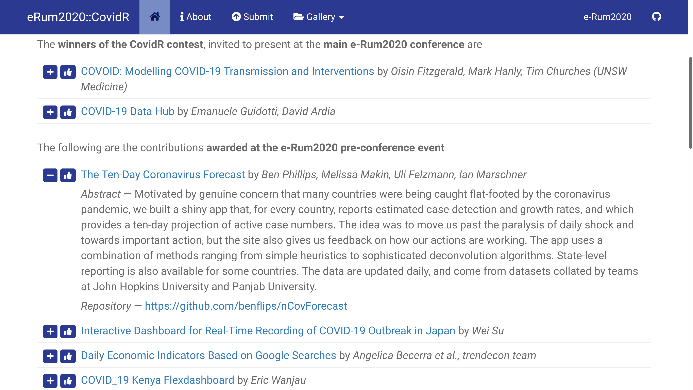
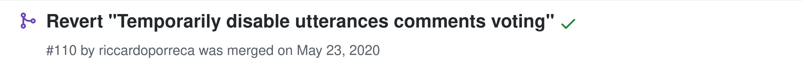

```{r setup, include=FALSE}
options(htmltools.dir.version = FALSE)
knitr::opts_chunk$set(eval = FALSE)
with_excluded <- FALSE
```

layout: true

<div class="my-footer"><span>Copyright (c) 2021</span></div>

---

## Motivation &ndash; e-Rum2020::CovidR 

.pull-left[


]

.pull-right[

#### e-Rum2020

- [2020.erum.io](https://2020.erum.io)
- [Afterthoughts of e-Rum2020](https://mirai-solutions.ch/news/2021/03/05/eRum2020-article) (Blog post)
- [e-Rum2020: how we turned a physical conference into a successful virtual event](https://journal.r-project.org/archive/2020-2/erum.pdf) (The R Journal)

]

--

#### Engage the R community around the topic of the COVID-19 pandemic

- **CovidR**: Contest of open-source contributions (Apr 17 - May 22 2020)

  - Built around an **open-source** repository [<span class="fa fa-github"></span> Milano-R / erum2020-covidr-contest](https://github.com/Milano-R/erum2020-covidr-contest)
  - **Gallery website** collecting and showcasing contributions: [milano-r.github.io/erum2020-covidr-contest](https://milano-r.github.io/erum2020-covidr-contest)
  - **Pre-conference event** (May 29 2020)


---

## Motivation &ndash; e-Rum2020::CovidR 

<a href="https://milano-r.github.io/erum2020-covidr-contest">
```{r eval=TRUE, echo=FALSE, fig.alt='List of contributions in the CovidR home page', out.extra='class="img-covidr-website"'}

```
</a>

---

## Motivation &ndash; e-Rum2020::CovidR 

<a href="https://milano-r.github.io/erum2020-covidr-contest">
```{r eval=TRUE, echo=FALSE, fig.alt='The CovidR contributions gallery menu', out.extra='class="img-covidr-website"'}
knitr::include_graphics("img/CovidR-home-contributions-menu.png")
```
</a>

---

## Motivation &ndash; e-Rum2020::CovidR 

<a href="https://milano-r.github.io/erum2020-covidr-contest/covid19datahub">
```{r eval=TRUE, echo=FALSE, fig.alt='An example of CovidR contribution gallery page', out.extra='class="img-covidr-website"'}
knitr::include_graphics("img/CovidR-gallery-page.png")
```
</a>

---

## Contributions: Relevant information

<a href="https://milano-r.github.io/erum2020-covidr-contest/covid19datahub">
```{r eval=TRUE, echo=FALSE, fig.alt='An example of CovidR contribution gallery page, with highlighted elements for the contribution\'s title, authors, repository, abstract', out.extra='class="img-covidr-website"'}
knitr::include_graphics("img/CovidR-gallery-page-contribution-elements.png")
```
</a>

---

## Contributions: Submission & Integration


Contribution details [submitted as a YAML metadata file](https://milano-r.github.io/erum2020-covidr-contest/submit.html)

.inverse-60-40-left-column.no-first-top-margin[

]

--

.inverse-60-40-right-column.no-first-top-margin[
    
- Collected in the **GitHub repo**<br/>[<span class="fa fa-github"></span> Milano-R / erum2020-covidr-contest](https://github.com/Milano-R/erum2020-covidr-contest)

  - Pull Requests / GitHub Issues
  - GitHub [_Community_](https://github.com/Milano-R/erum2020-covidr-contest/community) features (templates)
  - See [CovidR Submission 101](https://youtu.be/pqrcxRL7AtU) video

]

--

.inverse-60-40-right-column[

- Each new contribution integrated in the CovidR gallery website
  
  - **R markdown** website (GitHub Pages)
  - YAML -> Gallery page:<br/>
    new package **`{rmdgallery}`**
  - **Badges**, **_likes_**
  - Highly-**automated**:<br/>
    CI/CD (& more) via **GitHub Actions**
  
]

---

## `{rmdgallery}`: Rmd Gallery Site Generator

- [<span class="fa fa-github"></span> riccardoporreca / rmdgallery](https://github.com/riccardoporreca/rmdgallery)
  - 
    ```r
    remotes::install_github("riccardoporreca/rmdgallery")
    ```
  - pkgdown [riccardoporreca.github.io/rmdgallery](https://riccardoporreca.github.io/rmdgallery/), example usage [<span class="fa fa-github"></span> riccardoporreca / rmd-gallery-example](https://github.com/riccardoporreca/rmd-gallery-example#readme)
- [`rmdgallery::gallery_site()`](https://riccardoporreca.github.io/rmdgallery/reference/gallery_site.html): Custom R Markdown [site generator](https://bookdown.org/yihui/rmarkdown/rmarkdown-site.html#custom-site-generators)

  - Rendered as [_simple_ R Markdown website](https://bookdown.org/yihui/rmarkdown/rmarkdown-site.html) via `rmarkdown::render_site()`
  - Include  a gallery of (embedded) pages created from metadata in YAML (or JSON) format

--

### Inspiration

- [hexb.in](http://hexb.in/): community-curated list of hexagon stickers (`.json` files on GitHub) &ndash; R.I.P. (?)

- [Jekyll](https://jekyllrb.com): simple, blog-aware, static site generator
  - Markdown, Liquid template language, Collections, YAML (meta)data
--

  - [Shiny app deployment and integration into a custom website gallery](https://user2019.r-project.org/static/pres/t258350.pdf), ToulouseR!2019 [<span class="fa fa-youtube"></span>](https://youtu.be/DizjPeNTeeo)

<a href="https://user2019.r-project.org/static/pres/t258350.pdf">
```{r eval=TRUE, echo=FALSE, fig.alt='Diagram from the useR!2019 talk about automated deployment to the cloud of a Shiny app and its integration into a custom website gallery', out.extra='style="position: absolute; bottom: 35px; right: 0; height: 400px;"'}
knitr::include_graphics("img/Shiny-app-deployment-custom-gallery-integration.png")
```
</a>


---

## `{rmdgallery}`: Metadata

**YAML** (or **JSON**) files containing relevant **metadata** for the gallery pages, rendered based on **`template`**s

.pull-left.no-first-top-margin[
Individual metadata files .fontsize80[(`single_meta: true`)]
```yml
 `# meta/html-example.yml`
 `title`: Embed raw html content
 `menu_entry`: HTML example
 `template: embed-html`
 `content: "<h3>Hello Rmd Gallery</h3>"`
```
```yml
 `# meta/url-example.yml`
 `title`: Embed content from a URL
 `menu_entry`: URL example
 `menu_icon`: fa-gear
 `template: embed-url`
 `content: https://example.com`
```
```yml
 `# meta/script-example.yml`
 `title`: Embed content via JavaScript`
 `menu_entry`: Script example
 `template: embed-script`
 `content: "https://[..].js"`
```
]

--

.pull-right.no-first-top-margin[
Collection metadata files .fontsize80[(`single_meta: false`)]
```yml
 # meta/*.yml
 `html-example`:
   `title`: Embed raw html content
   `menu_entry`: HTML example
   `template: embed-html`
   `content: "<h3>Hello Rmd Gallery</h3>"`
 
 `url-example`:
   `title`: Embed content from a URL
   `menu_entry`: URL example
   `menu_icon`: fa-gear
   `template: embed-url`
   `content: https://example.com`
   `custom_field`: Additional custom metadata
 
 `script-example`:
   `title`: Embed content via JavaScript
   `menu_entry`: Script example
   `template: embed-script`
   `content: "https://[..].js"`
 ```
]

--

<div style="position: absolute; bottom: 160px; left: 345px; background-color: #fbff88; border: solid 5px #4b9dcb; border-radius: 10px; padding: 0 20px;">
<div></div>

Page metadata rendered<br>as HTML gallery page,<br/>linked as gallery menu entry
- `html-example.html`
- `url-example.html`
- `script-example.html`

</div>

---

## `{rmdgallery}`: Usage and configuration


.pull-left[

Specify as R Markdown [`site:` generator](https://bookdown.org/yihui/rmarkdown/rmarkdown-site.html#custom-site-generators)

```yaml
# index.(R)md
title: "My Gallery Website"
site: rmdgallery::gallery_site
```

High degree of [Configuration & Customization](https://riccardoporreca.github.io/rmdgallery/#configuration-and-customization)

Custom extra content before and after the main `content` via `include_before/_after`:<br/>HTML or R [`{htmltools}`](https://rstudio.github.io/htmltools) expression accessing metadata fields via `{{...}}`
```html
<hr>include_before for {{title}}<hr/>
```
```r
{{htmltools::tagList(
    htmltools::hr(),
    "include_after for", title,
    htmltools::hr()
)}}
```

]


.pull-right[

```yaml
# _site.yml
name: "my-website"
navbar:
# [...]
*gallery:
  meta_dir: "meta"
  single_meta: false
  order_by: [title, desc(another_field)]
  template_dir: "custom/templates/path"
  type_field: my_type
  type_template:
    gist: embed-script
  defaults:
    template: embed-url
* navbar:
*   left:
*   - text: "Gallery"
*     icon: fa-folder-open
# optional 
* include_before: _incl/before_gallery.html
* include_after: _incl/after_gallery.R
```
]


--


```{r eval=TRUE, echo=FALSE, fig.alt='An example of CovidR contribution gallery page, with highlighted {rmdgallery} page elements (gallery menu, include_before, content, include_after)', out.extra='class="img-covidr-website', out.extra='style="position: absolute; bottom: 20px; left: 75px; height: 550px;"'}

```


---

## `{rmdgallery}`: Parsed Configuration / Metadata

- [`rmdgallery::gallery_site_config()`](https://riccardoporreca.github.io/rmdgallery/reference/gallery_site_config.html)<br/>
  Configuration `list` (from `_site.yml`), **including parsed metadata** as `$gallery$meta`

- The parsed metadata can be used to create arbitrary content in any standard `.Rmd` website page.

- Example: R code chunk creating an index / ToC for the gallery pages via [`{htmltools}`](https://rstudio.github.io/htmltools)<br>
  [<span class="fa fa-github"></span> `rmd-gallery-example/index.Rmd#L12-L26`](https://github.com/riccardoporreca/rmd-gallery-example/blob/1fdd41060b52a246a7c51d20c7bdbc00a49b521a/index.Rmd#L12-L26)

  ```r
    *meta <- rmdgallery::gallery_site_config()$gallery$meta
    htmltools::tags$ul(
      lapply(`names(meta)`, function(name) {
        href <- sprintf(`"%s.html", name`)
        with(`meta[[name]]`, {
          htmltools::tags$li(
            htmltools::a(href = href, `title`),
            "by", `author`, 
            htmltools::a(href = `url`, target = "_blank", "[source]")
          )
        })
      })
    )
```
--

- Next level: [CovidR homepage](https://milano-r.github.io/erum2020-covidr-contest/index.html)  (index by contest result, collapsibles, modals, ...) via [`{htmltools}`](https://rstudio.github.io/htmltools) + [`{bsplus}`](http://ijlyttle.github.io/bsplus)<br/>
  [<span class="fa fa-github"></span> `erum2020-covidr-contest/contest/index.Rmd`](https://github.com/Milano-R/erum2020-covidr-contest/blob/master/contest/index.Rmd)

---

## `{rmdgallery}`: Parsed Configuration / Metadata

<a href="https://milano-r.github.io/erum2020-covidr-contest">
```{r eval=TRUE, echo=FALSE, fig.alt='List of contributions in the CovidR home page', out.extra='class="img-covidr-website"'}

```
</a>

---

## CovidR: Dynamic Badges


.pull-left[

- Fast [badgen.net](https://badgen.net) service

- Based on an [HTTPS endpoint](https://badgen.net/https) implemented in [RunKit](https://runkit.com/home#endpoint)

  - Simple Node.js API:
    <br/>[`runkit.com/erum2020-covidr/badge`](https://runkit.com/erum2020-covidr/badge)
  - Built around a live status `.yml` file
  
      - [`badge-endpoint.yml`](https://milano-r.github.io/erum2020-covidr-contest/badge-endpoint.yml)
      - generated with R & deployed as part of the CovidR gallery website builds
      - underlying status information updated with PRs

  - .fontsize80[
  [`https://badgen.net/https/runkit.io/erum2020-covidr/badge/branches/master/{{page_name}}`](https://badgen.net/https/runkit.io/erum2020-covidr/badge/branches/master/{{page_name}})
  ]

]

--

.pull-right[
<br/>
.fontsize80[`bsplus::bs_modal()` + `bsplus::bs_attach_modal()`]<br/>
.fontsize80[[`contest/_includes/before_gallery.R`](https://github.com/Milano-R/erum2020-covidr-contest/blob/a13b0ee2b2eec57bc523c7d6e50734863e35a9d8/contest/_includes/before_gallery.R#L20-L41)]


]

---


## CovidR: Community _Likes_ <span class="fa fa-thumbs-up"><span>

.center[
Engage the community by letting visitors vote for contributions they like
]

.pull-left[
<br/>
<br/>
.fontsize80[`bsplus::bs_modal()` + `bsplus::bs_attach_modal()`]


]

--

.pull-right[

🔮 **Utterances** ([utteranc.es](https://utteranc.es/))

- A lightweight comments widget built on GitHub issues. Use GitHub issues for blog comments, wiki pages **and more**!
  
- Peculiar usage: 👍 Reactions on a pre-defined comment

  - .fontsize80[[`contest/_tools/vote-modal.R`](https://github.com/Milano-R/erum2020-covidr-contest/blob/a13b0ee2b2eec57bc523c7d6e50734863e35a9d8/contest/_tools/vote-modal.R)]

  - .fontsize80[[`contest/_includes/before_gallery.R`](https://github.com/Milano-R/erum2020-covidr-contest/blob/a13b0ee2b2eec57bc523c7d6e50734863e35a9d8/contest/_includes/before_gallery.R#L66-L68)]

  - .fontsize80[[`contest/index.Rmd`](https://github.com/Milano-R/erum2020-covidr-contest/blob/a13b0ee2b2eec57bc523c7d6e50734863e35a9d8/contest/index.Rmd#L72-L84)]

  - .fontsize80[([`contest/_tools/utterances-issues.R`]( https://github.com/Milano-R/erum2020-covidr-contest/blob/a13b0ee2b2eec57bc523c7d6e50734863e35a9d8/contest/_tools/utterances-issues.R))]

]

---

## CovidR: "Automation!" (3x)

<div style="position: absolute; top:40px; right: 250px;">
<div></div>

[[e-Rum2020 CI/CD workshop](https://mirai-solutions.ch/news/2020/08/25/erum2020-workshop/)]

</div>


.pull-left[

**Streamlined** submission and integration

- Pull Requests / GitHub Issues
  
- GitHub [_Community_](https://github.com/Milano-R/erum2020-covidr-contest/community) features (templates)


**D**on't **R**epeat **Y**ourself<br/>
(let R **W**rite **E**verything **T**wice for you)

- Centralize content definition

  - README, YAML example, Issue / PR templates, CoC, Contributing, ...
  - Website info / submission page
      
- R puts everything together when rendering `.Rmd`s
  
  - [`README.Rmd`]() + [`.git/hooks/pre-commit`]()
  - [`contest/about.Rmd`]()
  - [`contest/submit.Rmd`]()


]


.pull-right[

]
  

---

## CovidR: "Automation!" (3x)
<div style="position: absolute; top:40px; right: 250px;">
<div></div>

[[e-Rum2020 CI/CD workshop](https://mirai-solutions.ch/news/2020/08/25/erum2020-workshop/)]

</div>

**CI/CD via GitHub Actions** [`.github/workflows/site.yaml`](https://github.com/Milano-R/erum2020-covidr-contest/blob/a13b0ee2b2eec57bc523c7d6e50734863e35a9d8/.github/workflows/site.yaml)

.pull-left.no-first-top-margin[
  
- Executed upon every push & pull requests (esp. with new contributions)

  - Ensures the gallery site can be built
  - Built site as artifact to preview the contribution integration in the gallery (w/o local checkout)
  
]

.pull-right.no-first-top-margin[

- Updated live website deployed from `main` (`master`)

- If no existing **utterances issue** is found, create one with the default standard comment

  - [`contest/_tools/utterances-issues.R`]( https://github.com/Milano-R/erum2020-covidr-contest/blob/a13b0ee2b2eec57bc523c7d6e50734863e35a9d8/contest/_tools/utterances-issues.R)
  - GitHub API: [`{gh}`](https://gh.r-lib.org/)

]      

--

.right-column-75.no-first-top-margin[
```yml
- name: Create utterances issues with voting comment
  run: |
    source("`contest/_tools/utterances-issues.R`")
    comment <- readLines("contest/_tools/`vote-comment.md`")
    `create_utterances_issues`(
      meta = rmdgallery::gallery_site_config("contest")`$gallery$meta`,
      owner = "Milano-R",
      repo = "erum2020-covidr-contest",
      site = "https://milano-r.github.io/erum2020-covidr-contest",
      comment = `comment`, `reaction = "+1"`
    )
  shell: Rscript {0}
```
]

---

## CovidR: "Automation!" (3x)

<div style="position: absolute; top:40px; right: 250px;">
<div></div>

[[e-Rum2020 CI/CD workshop](https://mirai-solutions.ch/news/2020/08/25/erum2020-workshop/)]

</div>

Contest evolution updates live in a [**matter of a Pull Request**](https://github.com/Milano-R/erum2020-covidr-contest/pulls?q=is%3Apr+is%3Aclosed)

.inverse-left-column.no-first-top-margin[

[](https://github.com/Milano-R/erum2020-covidr-contest/pull/112)<br/>
[](https://github.com/Milano-R/erum2020-covidr-contest/pull/111)<br/>
[](https://github.com/Milano-R/erum2020-covidr-contest/pull/110)<br/>
[](https://github.com/Milano-R/erum2020-covidr-contest/pull/100)<br/>
[](https://github.com/Milano-R/erum2020-covidr-contest/pull/97)<br/>
[](https://github.com/Milano-R/erum2020-covidr-contest/pull/96)<br/>

]

---

## CovidR: "Automation!" (3x)
<div style="position: absolute; top:40px; right: 250px;">
<div></div>

[[e-Rum2020 CI/CD workshop](https://mirai-solutions.ch/news/2020/08/25/erum2020-workshop/)]

</div>

.pull-middle[
### GitHub Actions bonus worflows
]

.pull-left.no-first-top-margin[

**Lock voting issues and extract votes**<br/>
.fontsize80[[`.github/workflows/utterances-lock-votes.yaml`](https://github.com/Milano-R/erum2020-covidr-contest/blob/a13b0ee2b2eec57bc523c7d6e50734863e35a9d8/.github/workflows/utterances-lock-votes.yaml)]

  - [`contest/_tools/utterances-issues.R`](https://github.com/Milano-R/erum2020-covidr-contest/blob/a13b0ee2b2eec57bc523c7d6e50734863e35a9d8/contest/_tools/utterances-issues.R#L237-L262)
    ```r
     `votes <- lock_utterances_issues`(
       owner = "Milano-R",
       repo = "erum2020-covidr-contest",
       dry_run = FALSE
     )
    ```
  - Manual trigger from R
    ```r
     gh::gh(
       "POST /repos/:owner/:repo/dispatches",
       owner = "Milano-R",
       repo = "erum2020-covidr-contest",
       event_type = "lock-utterances-votes"
     )
    ```
]


.pull-right.no-first-top-margin[

**Cleanup comments to voting issues**<br/>
.fontsize80[[`.github/workflows/utterances-cleanup.yaml`](https://github.com/Milano-R/erum2020-covidr-contest/blob/a13b0ee2b2eec57bc523c7d6e50734863e35a9d8/.github/workflows/utterances-cleanup.yaml)]

  - Polite approach: Collect all users who commented and notify, delete comments for already-notified users
  - [`contest/_tools/utterances-issues.R`](https://github.com/Milano-R/erum2020-covidr-contest/blob/a13b0ee2b2eec57bc523c7d6e50734863e35a9d8/contest/_tools/utterances-issues.R#L142-L234)
    ```r
     `cleanup_utterances_comments`(
       owner = "Milano-R",
       repo = "erum2020-covidr-contest",
       dry_run = FALSE
     )
    ```
  - Trigger every 12h or manually<br/>
    (`event_type = "cleanup-utterances"`)

]

---

class: inverse center middle
# Thank you!
